This flow shows how a headset product requirement becomes a baked sub-page UI.

```mermaid
flowchart TD
  PRINCIPLE["Note: Phase 1 reasons and freezes data.<br/>Phase 3 is deterministic, id-routed, and reproducible.<br/>No off-pipeline hand-patching."]

  subgraph P1["Phase 1: Authoring"]
    P1_REQ[Product requirement]
    P1_KNOWN{Known function keyword?}
    P1_ID[Choose explicit function id]
    P1_UNKNOWN[Author explicit new id]
    P1_SNAPSHOT{Snapshot functions/id.html exists?}
    P1_REF[Reference id plus rare overrides]
    P1_AUTHOR[Author subcontrols]
    P1_CHILD[For each sub-control slot]
    P1_SHAPE{Data shape?}
    P1_BOOL[Toggle family]
    P1_RANGE[Slider family]
    P1_SELECT[Select family]
    P1_ACTION[Button or link family]
    P1_GRID[Preset-grid family]
    P1_PRESENT{Select presentation?}
    P1_SEG[Segmented]
    P1_DROP[Dropdown]
    P1_PRESET[Preset-grid]
    P1_ICONS{Segmented icons needed?}
    P1_ICON_TRUE[Set icons true]
    P1_ICON_FALSE[Use labels only]
    P1_DERIVE[Derive shape: compact row, full-width stacked]
    P1_APPEAR{How does it appear?}
    P1_ALWAYS[Plain slot]
    P1_REVEAL[Write reveals map]
    P1_DEP[Write dependents]
    P1_CARD[Write nested function slot]
    P1_NEST{Nested slot has children?}
    P1_MANIFEST[Manifest: title, functions, subcontrols, reveals, dependents]

    P1_REQ --> P1_KNOWN
    P1_KNOWN -- "Yes, authoring only" --> P1_ID
    P1_KNOWN -- No --> P1_UNKNOWN
    P1_ID --> P1_SNAPSHOT
    P1_UNKNOWN --> P1_SNAPSHOT
    P1_SNAPSHOT -- Yes --> P1_REF
    P1_SNAPSHOT -- No --> P1_AUTHOR
    P1_REF --> P1_MANIFEST
    P1_AUTHOR --> P1_CHILD
    P1_CHILD --> P1_SHAPE
    P1_SHAPE -- Boolean --> P1_BOOL
    P1_SHAPE -- Ordered range --> P1_RANGE
    P1_SHAPE -- Pick one --> P1_SELECT
    P1_SHAPE -- Action or entry --> P1_ACTION
    P1_SHAPE -- Preset cards --> P1_GRID
    P1_SELECT --> P1_PRESENT
    P1_PRESENT -- Few visible modes --> P1_SEG
    P1_PRESENT -- Many or tight --> P1_DROP
    P1_PRESENT -- Preset semantics --> P1_PRESET
    P1_SEG --> P1_ICONS
    P1_ICONS -- Yes --> P1_ICON_TRUE
    P1_ICONS -- No --> P1_ICON_FALSE
    P1_BOOL --> P1_DERIVE
    P1_RANGE --> P1_DERIVE
    P1_ACTION --> P1_DERIVE
    P1_GRID --> P1_DERIVE
    P1_DROP --> P1_DERIVE
    P1_PRESET --> P1_DERIVE
    P1_ICON_TRUE --> P1_DERIVE
    P1_ICON_FALSE --> P1_DERIVE
    P1_DERIVE --> P1_APPEAR
    P1_APPEAR -- Always --> P1_ALWAYS
    P1_APPEAR -- Selector choice --> P1_REVEAL
    P1_APPEAR -- Toggle off grey-out --> P1_DEP
    P1_APPEAR -- Whole nested card --> P1_CARD
    P1_ALWAYS --> P1_NEST
    P1_REVEAL --> P1_NEST
    P1_DEP --> P1_NEST
    P1_CARD --> P1_NEST
    P1_NEST -- Yes, recurse --> P1_CHILD
    P1_NEST -- No --> P1_MANIFEST
  end

  subgraph P2["Phase 2: Validation gate"]
    P2_RUN[Run validate-manifest.py]
    P2_SHAPE{Manifest readable and shaped?}
    P2_ARCH{Archetype in allowed enum?}
    P2_COND{Stray condition?}
    P2_REVEALS{Reveals only selector and key matches?}
    P2_DEP{Dependents only toggle?}
    P2_COUNT{Options <= 6?}
    P2_DUP{Duplicate option value or label?}
    P2_FN{Function slot snapshot exists?}
    P2_FAIL_FLAG[Record validation failure]
    P2_ANY{Any check fail?}
    P2_HALT[HALT: fix manifest at source]
    P2_PASS[All checks pass]

    P2_RUN --> P2_SHAPE
    P2_SHAPE -- Yes --> P2_ARCH
    P2_SHAPE -- No --> P2_FAIL_FLAG
    P2_ARCH -- Yes --> P2_COND
    P2_ARCH -- No --> P2_FAIL_FLAG
    P2_COND -- Yes --> P2_FAIL_FLAG
    P2_COND -- No --> P2_REVEALS
    P2_REVEALS -- Yes --> P2_DEP
    P2_REVEALS -- No --> P2_FAIL_FLAG
    P2_DEP -- Yes --> P2_COUNT
    P2_DEP -- No --> P2_FAIL_FLAG
    P2_COUNT -- Yes --> P2_DUP
    P2_COUNT -- No --> P2_FAIL_FLAG
    P2_DUP -- Yes --> P2_FAIL_FLAG
    P2_DUP -- No --> P2_FN
    P2_FN -- Yes or none --> P2_ANY
    P2_FN -- No --> P2_FAIL_FLAG
    P2_FAIL_FLAG --> P2_ANY
    P2_ANY -- Yes --> P2_HALT
    P2_ANY -- No --> P2_PASS
  end

  subgraph P3["Phase 3: Generation"]
    P3_FRAME[Copy subpage-frame and rewrite CSS paths]
    P3_HOME[Fill identity, connection, collapsed nav from home.manifest]
    P3_FUNCTION[For each function id]
    P3_SNAPSHOT{Snapshot functions/id.html exists?}
    P3_COPY[Copy card whole plus rare overrides]
    P3_ASSEMBLE[Assemble with headset-function]
    P3_SHELL[Copy function shell]
    P3_SUB[Copy subcontrols/archetype.html and fill slots]
    P3_RENDER[Render compact row or stacked subfn-label]
    P3_REVEALS{Sub-control has reveals?}
    P3_PANELS[Emit ordered segment-panels]
    P3_PANEL_FN{Panel slot is function?}
    P3_UNWRAP[Render function unwrapped]
    P3_PANEL_SUB[Render sub-control slot]
    P3_RECURSE[Recurse into panel slots]
    P3_DEP{Toggle has dependents?}
    P3_GROUP[Wrap toggle and dependents in subfn-group]
    P3_DEP_SLOTS[Render dependent slots recursively]
    P3_ICON_TRUE{Segmented icons true?}
    P3_ICON_FILE{Icon file exists?}
    P3_ICON_COPY[Copy segment icon]
    P3_ICON_HALT[HALT: ask or fix icon value]
    P3_DONE[Function rendered]
    P3_STRIP[Strip data-slot, data-instruction, data-property]
    P3_OUT[Baked reproducible HTML page]

    P3_FRAME --> P3_HOME
    P3_HOME --> P3_FUNCTION
    P3_FUNCTION --> P3_SNAPSHOT
    P3_SNAPSHOT -- Yes --> P3_COPY
    P3_SNAPSHOT -- No --> P3_ASSEMBLE
    P3_ASSEMBLE --> P3_SHELL
    P3_SHELL --> P3_SUB
    P3_SUB --> P3_RENDER
    P3_RENDER --> P3_REVEALS
    P3_REVEALS -- Yes --> P3_PANELS
    P3_PANELS --> P3_PANEL_FN
    P3_PANEL_FN -- Yes --> P3_UNWRAP
    P3_PANEL_FN -- No --> P3_PANEL_SUB
    P3_UNWRAP --> P3_RECURSE
    P3_PANEL_SUB --> P3_RECURSE
    P3_RECURSE --> P3_DEP
    P3_REVEALS -- No --> P3_DEP
    P3_DEP -- Yes --> P3_GROUP
    P3_GROUP --> P3_DEP_SLOTS
    P3_DEP_SLOTS --> P3_ICON_TRUE
    P3_DEP -- No --> P3_ICON_TRUE
    P3_ICON_TRUE -- Yes --> P3_ICON_FILE
    P3_ICON_TRUE -- No --> P3_DONE
    P3_ICON_FILE -- Yes --> P3_ICON_COPY
    P3_ICON_FILE -- No --> P3_ICON_HALT
    P3_ICON_COPY --> P3_DONE
    P3_COPY --> P3_DONE
    P3_DONE --> P3_STRIP
    P3_STRIP --> P3_OUT
  end

  PRINCIPLE --> P1_REQ
  P1_MANIFEST --> P2_RUN
  P2_HALT -- "Loop back: fix manifest, never hand-edit HTML" --> P1_REQ
  P2_PASS --> P3_FRAME
```

Legend: Diamonds are decisions. Rectangles are deterministic authoring, validation, or copy/fill steps. HALT means stop and repair the manifest or missing snippet/icon source before rerunning.
